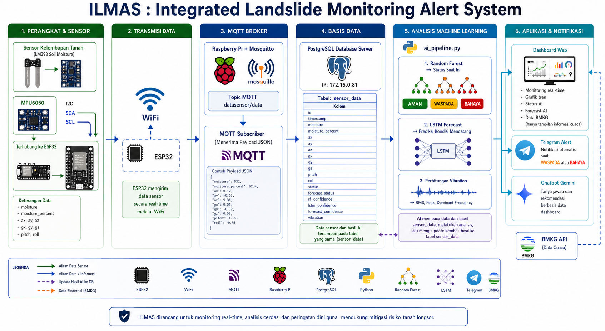
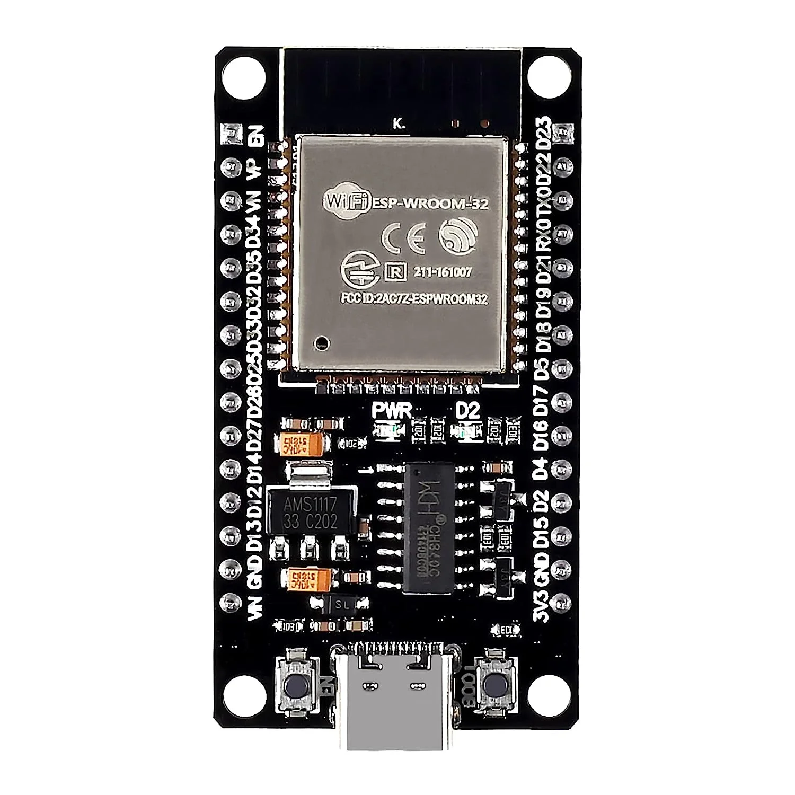
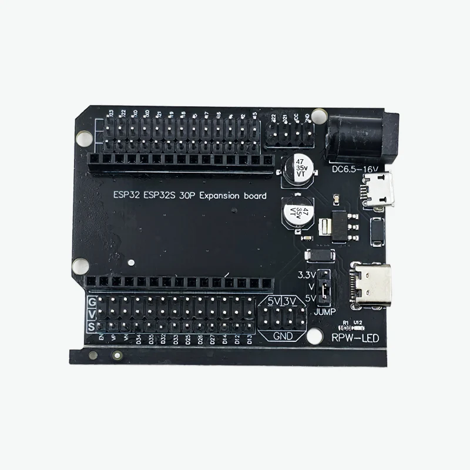
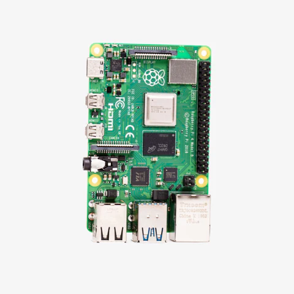
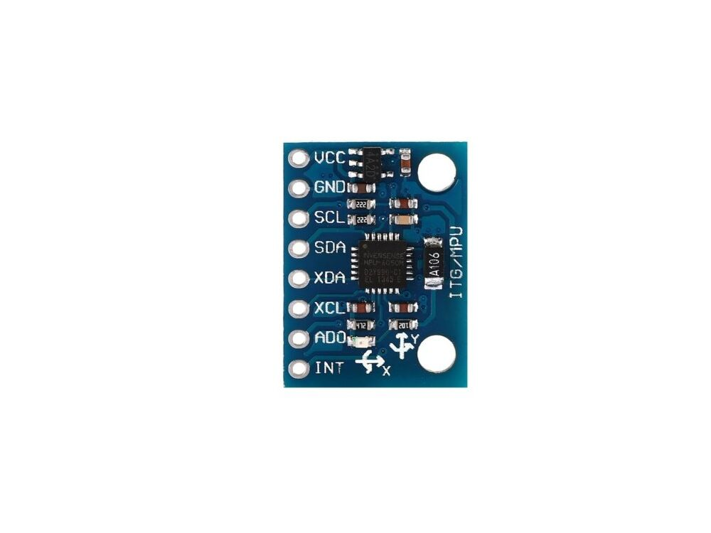
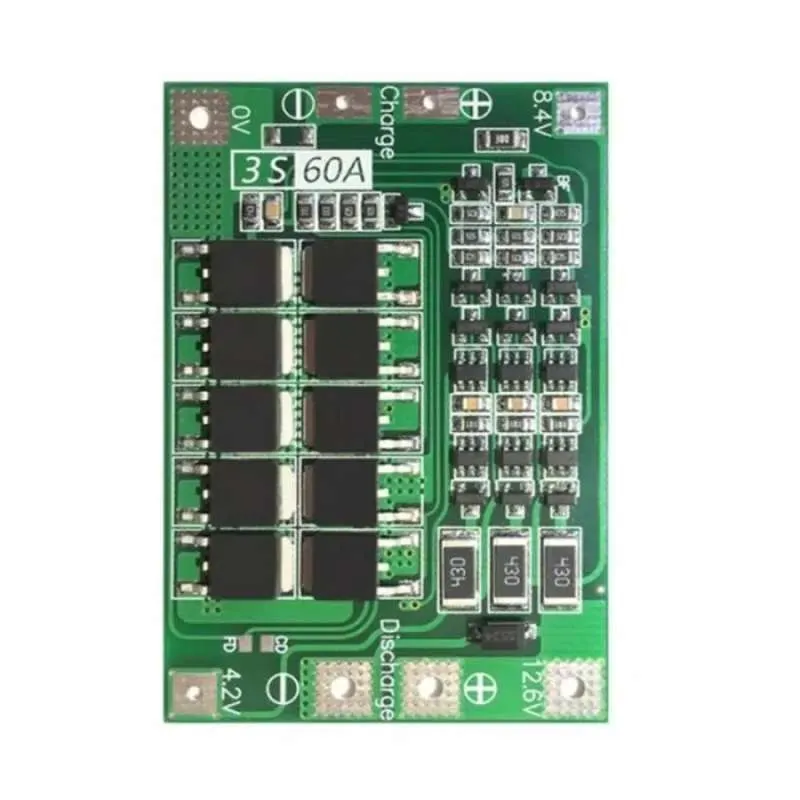
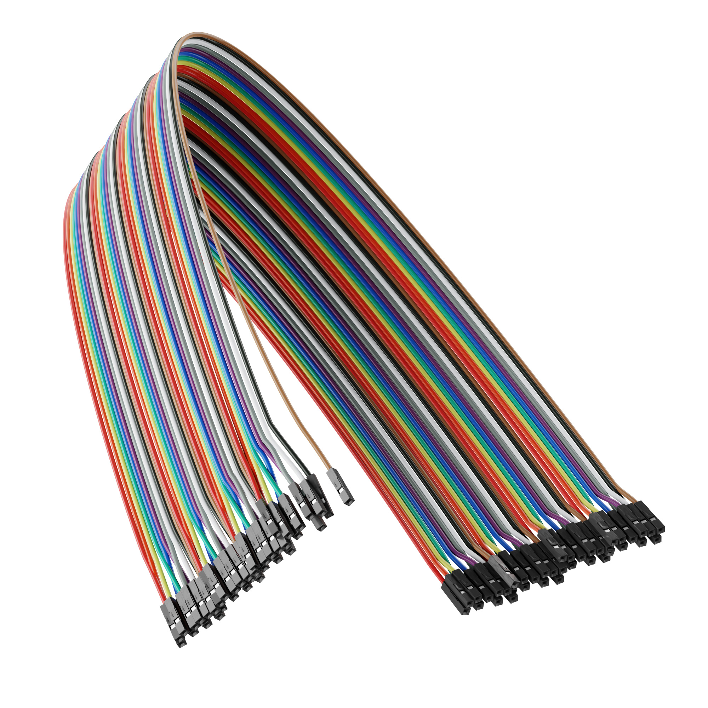
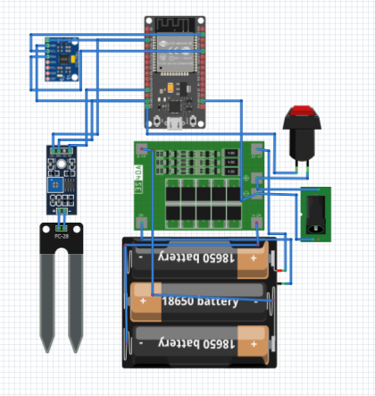
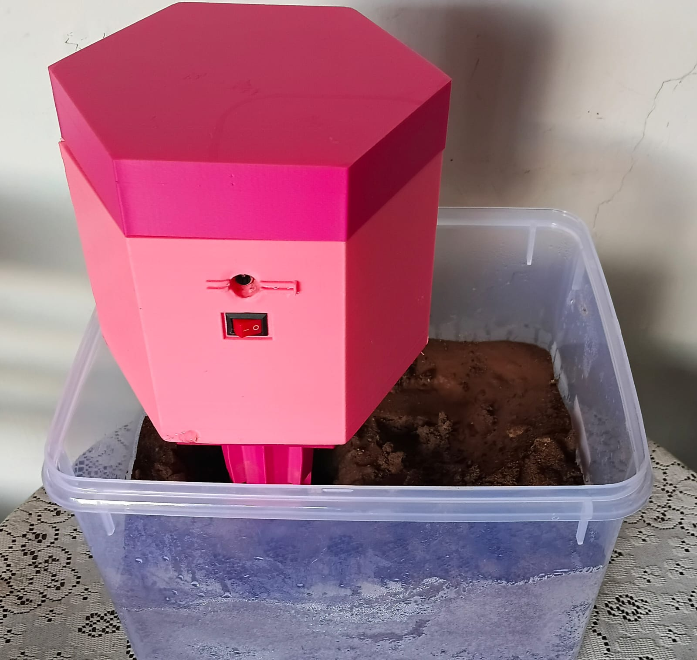
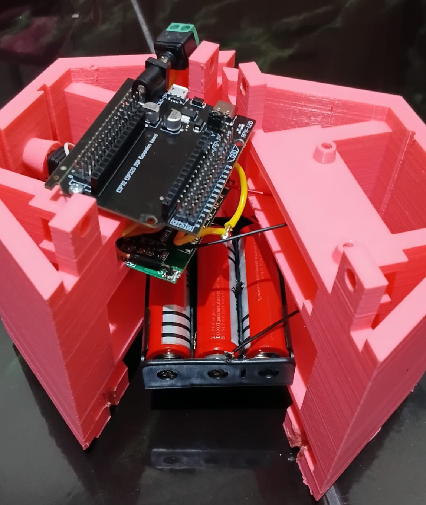

# ILMAS — Intelligent Landslide Monitoring and Alert System

Sistem deteksi dini bencana tanah longsor berbasis IoT dan kecerdasan buatan yang memantau kondisi tanah secara *real-time*, mengklasifikasikan tingkat bahaya menggunakan model *machine learning*, serta mengirimkan peringatan otomatis melalui Telegram.

---
## Kelompok 1

| No | Nama                  | NRP        | Peran                                                                 |
|----|-----------------------|------------|-----------------------------------------------------------------------|
| 1  | Athaya Khairani Adi    | 5024241007 | Sensor & Database Configuration, Web Developer, AI Engineer           |
| 2  | Devi Putri Sekar Arum  | 5024241049 | Machine Learning Engineer, Web Developer, AI Engineer                 |
| 3  | Muhammad Sayyid Tsabit | 5024241013 | 3D Designer & Prototype Developer                                     |
| 4  | Xyz Frizy Firstyaji    | 5024221073 | Video Editor                                                          |


## Daftar Isi
1. [Deskripsi Proyek](#1-deskripsi-proyek)
2. [Alur Sistem](#2-alur-sistem)
3. [Alat dan Bahan](#3-alat-dan-bahan)
4. [Dokumentasi](#4-dokumentasi)
5. [Teknologi yang Digunakan](#5-teknologi-yang-digunakan)
6. [Struktur Basis Data](#6-struktur-basis-data)
7. [Panduan Instalasi](#7-panduan-instalasi)
8. [Video Demonstrasi](#8-video-demonstrasi)

---

## 1. Deskripsi Project

ILMAS (*Intelligent Landslide Monitoring and Alert System*) adalah sistem pemantauan longsor yang terintegrasi dari lapisan perangkat keras (*hardware*) hingga antarmuka web dan notifikasi. Sistem ini dirancang untuk mendeteksi dua faktor utama pemicu longsor secara simultan, yaitu kadar kelembaban tanah dan pergerakan/getaran lereng, kemudian mengolah data tersebut menggunakan dua model *machine learning* untuk menghasilkan status klasifikasi kondisi saat ini (*current status*) dan prediksi kondisi ke depan (*forecast status*).

Sistem terdiri atas empat lapisan utama yang bekerja secara berkesinambungan:

- **Lapisan Sensor (Edge Layer)**  
  ESP32 membaca data dari sensor kelembaban tanah dan sensor IMU MPU6050 setiap 5 detik. Data sensor kemudian dikirimkan menggunakan protokol MQTT menuju broker lokal yang berjalan pada Raspberry Pi.

- **Lapisan Data (Data Layer)**  
  Raspberry Pi bertindak sebagai subscriber MQTT yang menerima payload data dalam format JSON dari ESP32. Data yang diterima selanjutnya disimpan ke dalam basis data PostgreSQL pada server.

- **Lapisan Kecerdasan Buatan (AI Layer)**  
  Pipeline AI mengambil data terbaru dari basis data untuk diproses menggunakan model Random Forest dan LSTM. Model Random Forest digunakan untuk mengklasifikasikan kondisi lahan saat ini, sedangkan model LSTM digunakan untuk melakukan prediksi (forecast) kondisi di masa mendatang. Hasil prediksi kemudian disimpan kembali ke basis data.

- **Lapisan Tampilan dan Notifikasi (Presentation Layer)**  
  Dashboard web berbasis Laravel menampilkan data sensor, grafik pemantauan, status kondisi lahan, serta hasil prediksi secara real-time. Jika sistem mendeteksi status **WASPADA** atau **BAHAYA**, notifikasi otomatis akan dikirim melalui Telegram Bot beserta detail data sensor dan hasil analisis yang relevan.
### Kelas Klasifikasi

| Status | Keterangan | Tindakan |
|--------|------------|----------|
| AMAN | Kondisi tanah normal, tidak ada indikasi bahaya | Pemantauan rutin |
| WASPADA | Indikasi awal ketidakstabilan tanah terdeteksi | Pemantauan intensif dan persiapan evakuasi |
| BAHAYA | Risiko longsor tinggi, kondisi kritis | Evakuasi segera |

---

## 2. Alur Sistem

Berikut alur lengkap sistem dari pembacaan sensor hingga pengiriman notifikasi.
<p align="center">
  
</p>


### Detail Alur Data Sensor

Setiap paket data yang dikirim ESP32 melalui MQTT berisi bidang-bidang berikut dalam format JSON.

```json
{
  "moisture": 1255,
  "moisture_percent": 69,
  "ax": -368, "ay": 10784, "az": 13568,
  "gx": -137, "gy": 164,  "gz": 172,
  "pitch": -1.22,
  "roll": 38.47
}
```

Nilai `vibration` dihitung di sisi penerima dengan rumus:

```
vibration = |ax| + |ay| + |az|
```

Kolom `status`, `forecast_status`, `forecast_confidence`, `rf_confidence`, dan `lstm_confidence` diisi oleh `ai_pipeline.py` melalui perintah `UPDATE` setelah proses inferensi selesai.

---

## 3. Alat dan Bahan

| No. | Komponen | Visual / Foto | Fungsi | Keterangan |
| :--- | :--- | :--- | :--- | :--- |
| 1 | **ESP32 DevKit V1** |  | Mikrokontroler utama | Membaca sensor, mengirim data via MQTT over WiFi. |
| 2 | **ESP32 Expansion Board** |  | Papan ekspansi distribusi | Memperluas pin I/O dan mempermudah distribusi jalur daya (VCC/GND) tanpa breadboard. |
| 3 | **Raspberry Pi 4 Model B** |  | Server lokal (Gateway) | Menjalankan MQTT broker, program penerima data, dan AI pipeline. |
| 4 | **Sensor Kelembaban Tanah** |  | Mengukur kadar air tanah | Output analog 0–4095 (ADC 12-bit). |
| 5 | **MPU6050** |  | Mengukur akselerasi & kemiringan | Komunikasi I2C. |
| 6 | **Baterai Li-ion 18650 & Case 3S** | <br> | Sumber daya utama lapangan | 3 buah baterai dirangkai seri. |
| 7 | **BMS 3S 12V** |  | Proteksi & Manajemen Daya | Mengatur balancing dan proteksi baterai. |
| 8 | **Adaptor AC/DC 12V & Jack** | <br><br> | Pengisian daya eksternal | Jalur pengisian ulang baterai. |
| 9 | **Saklar (Switch)** |  | Pemutus arus | Menghubungkan atau memutus daya sistem. |
| 10 | **Kabel Jumper, Pin Header Male & Timah Solder** | <br><br> | Koneksi elektrikal | Penghubung fisik antar komponen. |
### Skema Alat dan Bahan (Wiring Flow)

<p align="center">
  
</p>

### Desain Sasing (3D Model Casing)
Desain sasing terdiri dari 3 bagian utama, yaitu:
| No. | Bagian | Visual 3D | Fungsi | Keterangan |
| :--- | :--- | :--- | :--- | :--- |
| 1 | **Atap** | [Klik untuk Menampilan Visual Atap](./Casing%20Design/atappfixmm.stl) | Penutup bagian atas | Hanya satu bagian utuh |
| 2 | **Ruang Utama** | [Klik untuk Menampilan Visual Ruang Utama 1](./Casing%20Design/atasportmm.stl) <br><br> [Klik untuk Menampilan Visual Ruang Utama 2](./Casing%20Design/atasnonportmm.stl) | Penutup bagian utama seperti Esp32, Expansion Board, Baterai | Terbagi 2 bagian yang bisa disambung|
| 3 | **Ruang Bawah** | [Klik untuk Menampilan Visual Ruang Bawah 1](./Casing%20Design/bawahdpnmm.stl) <br><br> [Klik untuk Menampilan Visual Ruang Bawah 2](./Casing%20Design/bawahblkgmm.stl) | Penutup bagian bawah yaitu sensor soil moisture & LM393 serta MPU6050 | Terbagi 2 bagian yang bisa disambung|

Untuk melihat sasing secara utuh bisa dilihat dibawah:

[Klik di sini untuk melihat & memutar 3D Model Sasing Utuh](./Casing%20Design/desiot_full%20body.stl)

### Skema Koneksi ESP32

| Pin ESP32 | Terhubung ke |
|-----------|-------------|
| GPIO 34 | Data Soil Moisture Sensor |
| GPIO 21 (SDA) | SDA MPU6050 |
| GPIO 22 (SCL) | SCL MPU6050 |
| 3.3V | VCC MPU6050 |
| GND | GND semua komponen |



### Perangkat Lunak

| No. | Perangkat Lunak | Versi | Fungsi |
|-----|----------------|-------|--------|
| 1 | Arduino IDE | 2.x | Pemrograman firmware ESP32 |
| 2 | Python | 3.x | AI pipeline dan subscriber MQTT |
| 3 | Mosquitto | 2.x | MQTT broker lokal di Raspberry Pi |
| 4 | PostgreSQL | 14+ | Basis data penyimpan data sensor |
| 5 | PHP | 8.3 | Runtime web backend (Laravel) |
| 6 | Node.js / npm | 18+ | Build aset frontend (Vite + Tailwind CSS) |

---

## 4. Dokumentasi

### Tampilan Keseluruhan Perangkat

<p align="center">
  
</p>

### Detail Rangkaian ESP32 + Sensor dalam Casing
|  Bagian Tengah | Bagian Bawah |
|----------|----------|
|  |  |

### Tampilan Web Dashboard

<p align="center">
  
  
  
</p>

<p align="center">
  
  
  
</p>

<p align="center">
  
</p>

### Notifikasi Telegram

<p align="center">
  
</p>

---

## 5. Teknologi yang Digunakan

### Firmware (ESP32)

| Teknologi | Keterangan |
|-----------|------------|
| Arduino Framework | Framework pemrograman mikrokontroler ESP32 |
| Library `Wire.h` | Komunikasi I2C untuk MPU6050 |
| Library `MPU6050` | Membaca data akselerometer dan giroskop |
| Library `PubSubClient` | Klien MQTT untuk publikasi data ke broker |
| Library `ArduinoJson` | Serialisasi data sensor ke format JSON |
| Library `WiFi.h` | Koneksi WiFi ESP32 |

### Backend Raspberry Pi

| Teknologi | Keterangan |
|-----------|------------|
| Python 3.14.4 | Bahasa pemrograman utama AI pipeline dan subscriber MQTT |
| `paho-mqtt` | Klien MQTT untuk subscribe topic `datasensor/data` |
| `psycopg2` | Koneksi Python ke basis data PostgreSQL |
| `TensorFlow / Keras` | *Framework* deep learning untuk model LSTM |
| `scikit-learn` | *Framework* machine learning untuk model Random Forest |
| `joblib` | Serialisasi dan deserialisasi model (`lstm_scaler.pkl`, `rf_model.pkl`) |
| `numpy`, `pandas` | Manipulasi array dan *dataframe* untuk inferensi model |
| Mosquitto | MQTT broker lokal yang berjalan di Raspberry Pi |

### Model Machine Learning

| Model | Fungsi | Input | Output |
|-------|--------|-------|--------|
| **Random Forest** | Klasifikasi status kondisi saat ini | 10 fitur: moisture, moisture_percent, ax, ay, az, gx, gy, gz, pitch, roll | Status (AMAN/WASPADA/BAHAYA) + rf_confidence |
| **LSTM** | Prediksi *forecast* kondisi ke depan | Sekuens 20 data terakhir (10 fitur, dinormalisasi dengan `lstm_scaler.pkl`) | forecast_status + lstm_confidence |

### Web Dashboard

| Teknologi | Versi | Keterangan |
|-----------|-------|------------|
| Laravel | 13.8 | Framework PHP untuk web *backend* dan routing |
| PHP | 8.3 | Runtime bahasa pemrograman *backend* |
| Tailwind CSS | 4.0.0 | Framework CSS *utility-first* untuk antarmuka |
| Vite | 8.0.0 | *Build tool* aset frontend |
| Chart.js | CDN | Visualisasi grafik data sensor dan riwayat status |
| PostgreSQL | 14+ | Basis data relasional yang dibaca langsung oleh web |
| Gemini API (2.5 Flash) | v1beta | Model AI Google untuk fitur *chatbot* berbasis data sensor terkini |
| BMKG Open API | Publik | Data prakiraan cuaca Surabaya yang ditampilkan di *dashboard* |
| Telegram Bot API | v7+ | Pengiriman notifikasi peringatan otomatis ke *chat* Telegram |

### API Endpoint Web

| Method | Endpoint | Fungsi |
|--------|----------|--------|
| GET | `/` | Halaman utama *dashboard* |
| GET | `/api/sensor-now` | Data sensor terbaru beserta status dan *confidence* |
| GET | `/api/status-history` | Riwayat seluruh status untuk grafik garis |
| GET | `/api/forecast-history` | Riwayat *forecast*, *confidence*, dan data sensor |
| POST | `/api/chatbot` | *Endpoint* chatbot AI berbasis Gemini |

### Integrasi Eksternal

| Layanan | Fungsi |
|---------|--------|
| **Telegram Bot API** | Mengirim notifikasi WASPADA dan BAHAYA dengan *cooldown* otomatis (BAHAYA: 1 menit, WASPADA: 3 menit) |
| **BMKG Open API** | Menampilkan prakiraan cuaca Surabaya di *dashboard* (kondisi, curah hujan, suhu, kelembaban udara) |
| **Google Gemini 2.5 Flash** | Menjawab pertanyaan tentang kondisi sensor terkini melalui fitur *chatbot* |

---

## 6. Struktur Basis Data

### Tabel `sensor_data`

Tabel utama yang menyimpan seluruh data sensor dan hasil pengolahan data oleh Machine Learning

| Kolom | Tipe | Keterangan |
|-------|------|------------|
| `id` | SERIAL PRIMARY KEY | Identitas unik baris data |
| `timestamp` | TIMESTAMP | Waktu data diterima |
| `moisture` | INTEGER | Nilai ADC mentah sensor kelembaban (0–4095) |
| `moisture_percent` | INTEGER | Persentase kelembaban tanah (0–100%) |
| `ax`, `ay`, `az` | INTEGER | Akselerasi sumbu X, Y, Z dari MPU6050 |
| `gx`, `gy`, `gz` | INTEGER | Data giroskop sumbu X, Y, Z dari MPU6050 |
| `pitch` | NUMERIC | Sudut kemiringan pitch (derajat) |
| `roll` | NUMERIC | Sudut kemiringan roll (derajat) |
| `vibration` | NUMERIC | Nilai getaran hasil perhitungan: `\|ax\| + \|ay\| + \|az\|` |
| `status` | VARCHAR(20) | Status klasifikasi RF: AMAN/WASPADA/BAHAYA/UNKNOWN |
| `forecast_status` | VARCHAR(20) | Status prediksi LSTM ke depan |
| `forecast_confidence` | NUMERIC | Tingkat keyakinan prediksi LSTM (0–100%) |
| `rf_confidence` | NUMERIC | Tingkat keyakinan model Random Forest (0–100%) |
| `lstm_confidence` | NUMERIC | Tingkat keyakinan model LSTM (0–100%) |

---

## 7. Panduan Instalasi

### Prasyarat

- Raspberry Pi 4 dengan OS Raspberry Pi OS (Debian-based)
- Python 3.14.4 dengan pip
- PHP 8.3 dan Composer
- Node.js 18+ dan npm
- PostgreSQL 14+
- Mosquitto MQTT Broker

### Langkah 1 — Persiapan Basis Data

Buat basis data dan tabel di PostgreSQL.

```sql
CREATE DATABASE db_longsor;
CREATE USER user_longsor WITH PASSWORD 'password_kuat';
GRANT ALL PRIVILEGES ON DATABASE db_longsor TO user_longsor;

-- Buat tabel sensor_data
CREATE TABLE sensor_data (
    id               SERIAL PRIMARY KEY,
    timestamp        TIMESTAMP DEFAULT NOW(),
    moisture         INTEGER,
    moisture_percent INTEGER,
    ax INTEGER, ay INTEGER, az INTEGER,
    gx INTEGER, gy INTEGER, gz INTEGER,
    pitch            NUMERIC(8,4),
    roll             NUMERIC(8,4),
    vibration        NUMERIC(12,4),
    status           VARCHAR(20) DEFAULT 'UNKNOWN',
    forecast_status  VARCHAR(20),
    forecast_confidence NUMERIC(6,2),
    rf_confidence    NUMERIC(6,2),
    lstm_confidence  NUMERIC(6,2)
);
```

### Langkah 2 — Konfigurasi ESP32

1. Buka `ilmas_esp.ino` menggunakan Arduino IDE.
2. Sesuaikan variabel berikut sesuai jaringan dan server yang digunakan.

```cpp
const char* ssid     = "NAMA_WIFI";
const char* password = "PASSWORD_WIFI";
const char* mqtt_server = "IP_RASPBERRY_PI";
```

3. Unggah (*upload*) firmware ke ESP32.

### Langkah 3 — Instalasi Program Raspberry Pi

```bash
pip install paho-mqtt psycopg2-binary tensorflow scikit-learn joblib numpy pandas
```

Jalankan subscriber MQTT (dapat juga digantikan oleh n8n):

```bash
python3 ilmas.py
```

Jalankan AI pipeline di *background*:

```bash
nohup python3 ai_pipeline.py &
```

### Langkah 4 — Instalasi Web Dashboard

```bash
cd ilmas-web
composer install
cp .env.example .env
php artisan key:generate
php artisan migrate
npm install
npm run build
php artisan serve --host=0.0.0.0 --port=8000
```

Sesuaikan isian `.env` berikut.

```env
DB_HOST=IP_SERVER_POSTGRES
DB_DATABASE=db_longsor
DB_USERNAME=user_longsor
DB_PASSWORD=password_kuat

GEMINI_API_KEY=API_KEY_GEMINI
TELEGRAM_BOT_TOKEN=TOKEN_BOT_TELEGRAM
TELEGRAM_CHAT_ID=CHAT_ID_TUJUAN
```


## 8. Video Demonstrasi
[Klik di sini untuk melihat video demonstrasi](https://drive.google.com/file/d/1K86XRRkkS0SOtEjkmsSaJ_Bi0FRVXc7J/view?usp=sharing) 

[Klik di sini untuk melihat video demonstrasi](https://drive.google.com/file/d/1iLurAB8LBT298cOFaYlzEavS7GAKbWdT/view?usp=drive_link)

